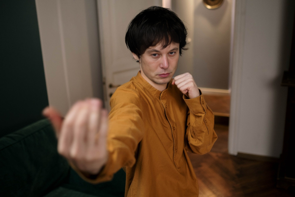

# Face Swapper

Swaps the face in the image with another face. Inspired by [roop](https://github.com/s0md3v/roop).

## Installation

Use docker to build the image:

```bash
docker build -t face-swapper .
```

Run the docker image:

```bash
docker run --rm -it -v $PWD:/home/ face-swapper bash
```

Install the requirements using poetry:

```bash
cd /home && poetry install && poetry shell
```

## Usage

```bash
python main.py -t <target_image> -s <source_image> -o <output_image>
```

* The first time it may take some time to download the models.

## Example

Target image:


Source image:


Result:



## Limitations

* Only one face need to be present in the images.
